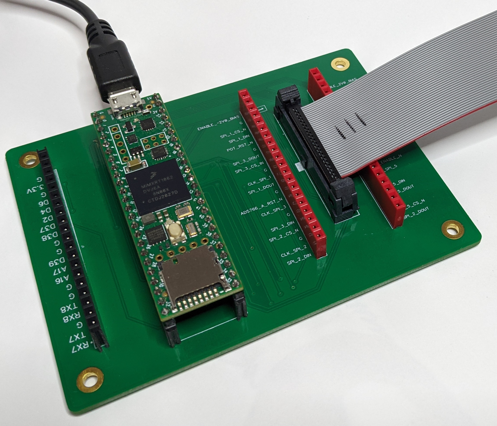
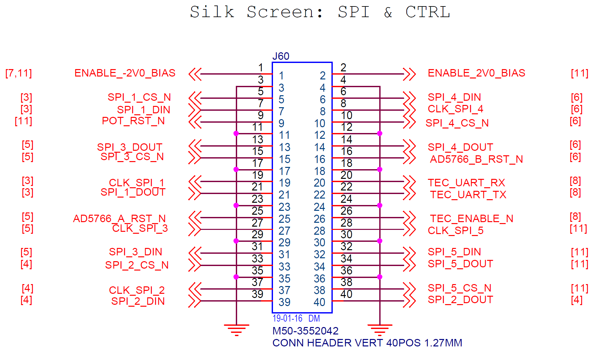

# Voyant Test Board

## Overview 



A thin board+firmware that provides...

1. a USB host serial interface that can exercise SPI and digital IO targets on the midboard via the M50 connector
2. a pass-thru serial port labeled "TEC_UART" via the M50 connector
3. an auxiliary header with additional pins available for digital IO, SPI, and serial. 

Not that all pins from the M50 connector are also directly available via break-out headers for debugging. 

## Usage

### M50 labels

Note that all of the labels on the M50 pins are from the other side's point of view. For example, `TEC_RX` is going out of the test board into the `TEC`, and `TEC_TX` is going out of the `TEC`. `SPI_1_DIN` is going out of the test-board and into the `DIN` pin of the AD7490 on the mid-board  and `SPI_5_DOUT` goes out of the `SDO` (Slave Data Out) pin of the AD5142 and into the `MISO` (Master In, Slave Out) of the test-board.   

### Serial ports

When you connect the test board to a host computer via USB, you should see two virtual serial ports appear. One of these is the `SPI command` and one is the `TEC_UART` pass-thru port. 

The command port is usually the first one, but not always. The most reliable way to tell is to load the Arduino IDE and 
look under "Tools->Port" and the command port will show up labeled as `Teensy`. The other new port will be the `TEC_UART` pass-thru.

#### `TEC_UART` pass-thru serial port

This is a direct pass-thru from the virtual USB port on the host to the `TEC_UART` RX and TX pins on the M50 connector. The connector serial port will track whatever the baud rate host serial port is set to.

Note that the parity and bits are always N,8,1 but this can be changed in the firmware if needed.

#### Additional pass-thru serial ports

You can add additional serial pass-thru ports to the `uart_bridges` array in the firmware. You will likely want to connect them to either `Serial7` or `Serial8`, which are both available on the aux connector. 

To enable the corresponding USB virtual serial port, change the `USB Type` in `Tools->Board` in the Arduino IDE to `Tripple Serial` before downloading the new code. 

#### `SPI command` serial port   

This serial connection accepts commands from the host according to the [API below](#api). These commands can send and receive data on the SPI ports, set the state of a few miscellaneous digital lines on the connector, and add delays.

Note that this virtual port will always run at USB maximum speed regardless of what baud rate it is set to on the host. That rate could be as high as 480Mbs, limited mostly by the host's USB bandwidth.

### SPI ports

There are a total of 7 SPI command targets and each has an identifying one character index name that is used to address the target in the API. Each SPI target has 4 associated pins: MISO, MOSI, CLK, and CS. The test-board is always the master and MISO is the only pin on each SPI port that is an input to the test-board. Any optional RESET pins are controlled using the[ digital IO commands](#Digital-IO-Commands) below.   

Again, remember that the labels on the M50 connector are from the mid-board's point of view! A `DOUT` label on the test board means that pin is an output from the mid-board and an input to the test-board!

SPI targets `1`-`6` are labeled on the M50 connector. 

  

SPI target `A` is on the aux header with these pins (`MISO` is the only pin input to the test-board)...


Note that currently all SPI ports run at 2MHz to reduce the chances of signal quality problems, but this can be increased on any or all ports with changes to the firmware. 

 


## API

The API is a set of ASCII text commands and responses that are sent over the SPI command serial port. Each command/response is a line that is terminated with any combination of carriage returns and/or line feeds. 

Every command sent to the test board generates a single response back to the host. All commands are currently synchronous so the responses will always be sent in the same order as the their requests.   


The maximum line length in either direction is currently 255 bytes.

### SPI Commands

#### Omnibus Error Response

`E`

The error response is sent in response to any invalid or malformed request. 

If `DEBUG` is #defined as `1`, then each error response will be preceded by a comment with text describing the error condition.

All errors should be considered exceptions and indicate either a logic problem or a config mismatch. 

#### Transfer

Sends a series of bytes to an SPI target and simultaneously reads the same number of bytes from that target.

##### Request Format:

| Content | Bytes | Desc |
| - | - | - | 
| `T` | 1 | Specifies transfer request |
| tag | 1 | Specifies SPI target port. Can be `1`-`6` or `A` |  
| data | 2,4,6,... | Variable length of bytes to send, each as a two digit ASCII hex number |

Note that if the data part is not an even number of chars then the last char will be ignored. 

Note that if data contains any non-hex digits then they will be interpreted as `0`.  

##### Responses

On success:

| Content | Bytes | Desc |
| - | - | - | 
| `S` | 1 | Specifies transfer success response |
| tag | 1 | Specifies SPI target port. Can be `1`-`6` or `A` |  
| data | 2,4,6,... | Variable length of bytes received, each as a two digit ASCII hex number. |

The number of bytes received will always be equal to the number sent in the corresponding transfer request command. 

On failure:
| Content | Bytes | Desc |
| - | - | - | 
| `E` | 1 | Specifies transfer error response |
| tag | 1 | Specifies SPI target port. Can be `1`-`6` or `A` |  
| reason | 1 | Reason for the failure |

Failure reasons:

| Byte | Reason |
| - | - | - | 
| `T` | Tag not found |
| `F` | Incomplete final byte (the number of digits in the data section was odd) |  
| `I` | Invalid digit (a digit in the data section was not a valid hex digit) |


  


For now, all SPI transfers are synchronous so the response will immediately follow the request.  


, you will get back the byte `S` followed by a variable number of two digit ASCII hex numbers continaing the bytes read from the SPI target. 


| Content | Bytes | Desc |
| - | - | - | 
| `` | 1 | Specifies transfer command |
| tag | 1 | Specifies SPI target port. Can be `1`-`6` or `A` |  
| data | 2,4,6,... | Variable length of bytes to send, each as a two digit ASCII hex number |
  


### Digital IO Commands

### Comments

### Interface control commands

## Development environment

To edit the firmware, you need to follow these steps to install the development environment...
 
``` 
 1. Install Arduino IDE https://www.arduino.cc/en/software
 2. Install Teensiduino from https://www.pjrc.com/teensy/td_download.html 
 3. Set the following in the Arduino Tools menu...
 
    Board     = Teensy->Teensyduino->Teensy 4.1
    USB Type  = Dual Serial
    CPU Speed = 600Mhz (default)
    Port      = (find the Teensy 4.1 board on this list)
 ```

Then open the `firmware.ino` file in the `software` section of this repo using the Arduino IDE, make any desired changes, and then click on the right-pointing arrow in the upper left corner of the IDE window. This will upload the new code to the Teensy board and run it. 