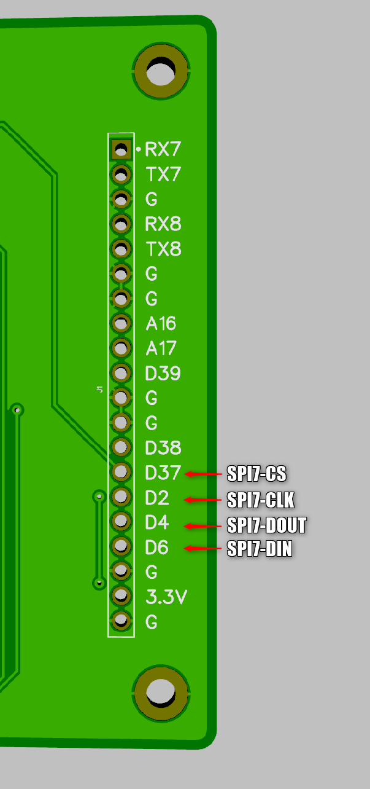

# Voyant Test Board

## Overview 


A thin board+firmware that provides a USB serial interface that can exercise SPI targets on the midboard via an M50 connector. The same M50 connector includes a pass-thru serial port labeled "TEC_UART". All pins from the M50 connector are also directly available via break-out headers for debugging. 

There is an auxiliary header that includes an additional SPI port, along with extra digital, analog, and UART pins for future expansion.   

## Usage

### Serial ports

When you connect the test board to a host computer via USB, you should see two virtual serial ports appear. One of these is the `SPI command` and one is the `TEC_UART` pass-thru port. 

The command port is usually the first one, but not always. The most reliable way to tell is to load the Arduino IDE and 
look under "Tools->Port" and the command port will show up labeled as `Teensy`. The other new port will be the `TEC_UART` pass-thru.

#### `TEC_UART` pass-thru serial port

This is a direct pass-thru from the virtual USB port on the host to the `TEC_UART` RX and TX pins on the M50 connector. The connector serial port will track whatever the baud rate host serial port is set to. Note that the parity and bits are always N,8,1 but this can be changed in the firmware if needed.

#### Additional pass-thru serial ports

You can add additional serial pass-thru ports to the `uart_bridges` array in the firmware. You will likely want to connect them to either `Serial7` or `Serial8`, which are both available on the aux connector. 

To enable the corresponding USB virtual serial port, change the `USB Type` in `Tools->Board` in the Arduino IDE to `Tripple Serial` before downloading the new code. 

#### `SPI command` serial port   

This serial connection accepts commands from the host according to the [API below](#api). These commands can send and receive data on the SPI ports, set the state of a few miscellaneous digital lines on the connector, and add delays. 

Note that this virtual port will always run at USB maximum speed regardless of what baud rate it is set to on the host. That rate could be as high as 480Mbs, limited mostly by the host's USB bandwidth.

## API

The API is a set of ASCII text commands and responses that are sent over the SPI command serial port. Each command/response is a line that is terminated with any combination of carriage returns and/or line feeds. Every command sent to the test board generates a response back to the host.

There are three types of commands: SPI Commands, Digital IO Commands, and comments.  

### SPI Commands

There are a total of 7 SPI command targets and each has an identifying index. Each SPI target has 4 associated pins: DIN, DOUT, CLK, and CS. Any optional RESET pins are controlled using the[ digital IO commands](#Digital-IO-Commands) below.   

SPI targets 1-6 are labeled on the M50 connector. 

  


SPI target 7 is on the break-out header.



Note that currently all SPI ports run at 2MHz to reduce the chances of signal quality problems, but this can be increased on any or all ports with changes to the firmware. 

 

### Digital IO Commands

## Development environment

To edit the firmware, you need to follow these steps to install the development environment...
 
``` 
 1. Install Arduino IDE https://www.arduino.cc/en/software
 2. Install Teensiduino from https://www.pjrc.com/teensy/td_download.html 
 3. Set the following in the Arduino Tools menu...
 
    Board     = Teensy->Teensyduino->Teensy 4.1
    USB Type  = Dual Serial
    CPU Speed = 600Mhz (default)
    Port      = (find the Teensy 4.1 board on this list)
 ```

Then open the `firmware.ino` file in the `software` section of this repo using the Arduino IDE, make any desired changes, and then click on the right-pointing arrow in the upper left corner of the IDE window. This will upload the new code to the Teensy board and run it. 