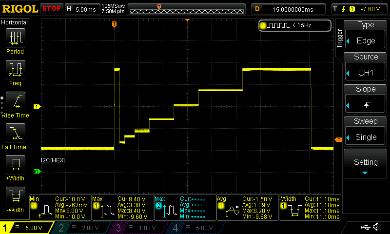

# Voyant Test Board

## Overview 


A thin board+firmware that provides...

1. a text-based USB host serial command interface
2. an M50 connector with SPI and digital IO targets on the midboard via the M50 connector
2. a pass-thru serial port labeled "TEC_UART" via the M50 connector
3. an auxiliary header with additional pins available for digital IO, SPI, analog IO, and serial. 

Not that all pins from the M50 connector are also directly available via break-out headers for debugging. 

## Usage

### M50 labels

Note that all of the labels on the M50 pins are from the other side's point of view. For example, `TEC_RX` is going out of the test board into the `TEC`, and `TEC_TX` is going out of the `TEC`. `SPI_1_DIN` is going out of the test-board and into the `DIN` pin of the AD7490 on the mid-board  and `SPI_5_DOUT` goes out of the `SDO` (Slave Data Out) pin of the AD5142 and into the `MISO` (Master In, Slave Out) of the test-board.   

### Serial ports

When you connect the test board to a host computer via USB, you should see two virtual serial ports appear. One of these is the `command` and one is the `TEC_UART`, which is a pass-thru port. 

The command port is usually the first one, but not always. The most reliable way to tell is to load the Arduino IDE and 
look under "Tools->Port" and the command port will show up labeled as `Teensy`. The other new port will be the `TEC_UART` pass-thru.

#### `TEC_UART` pass-thru serial port

This is a direct pass-thru from the virtual USB port on the host to the `TEC_UART` RX and TX pins on the M50 connector. The baud rate on the serial port on the connector will track whatever the baud rate host serial port was set to when last connected to.

Note that the parity and bits are always N,8,1 but this can be changed in the firmware if needed.

#### Additional pass-thru serial ports

You can add additional serial pass-thru ports to the `uart_bridges` array in the firmware. You will likely want to connect them to either `Serial7` or `Serial8`, which are both available on the aux connector. 

To enable the corresponding USB virtual serial port, change the `USB Type` in `Tools->Board` in the Arduino IDE to `Tripple Serial` before downloading the new code. 

#### `command` serial port   

This serial connection accepts commands from the host according to the [API below](#api). These commands can send and receive data on the SPI ports, set the state of digital IO lines on the connector, and add delays.

Note that this virtual port will always run at USB maximum speed regardless of what baud rate it is set to on the host. That rate could be as high as 480Mbs, limited mostly by the host's USB bandwidth.

### SPI targets

There are a total of 6 SPI targets and each has an identifying one character tag name that is used to address the target in the API. Each SPI target has 4 associated pins: MISO, MOSI, CLK, and CS. The test-board is always the master and MISO is the only pin on each SPI port that is an input to the test-board. Any optional RESET pins are controlled using the [digital IO set command](#Digital-IO-Set-Request) below.   

Again, remember that the labels on the M50 connector are from the mid-board's point of view! A `DOUT` label on the test board means that pin is an output from the mid-board and an input to the test-board!

SPI targets `1`-`5` are labeled on the M50 connector. 

  

SPI target `A` is on the aux header with these pins (`MISO` is the only pin input to the test-board)...


Note that currently all SPI ports run at 1MHz to reduce the chances of signal quality problems, but this can be increased on any or all ports with changes to the firmware. 

### Digital out targets

These are general purpose digital pins that can output either 0 volts or 3.3 volts. They are each capable of sinking or sourcing up to 10mA. Digital outputs are all initialized to `0` on power up. 

They are listed in the [IO target tags table](#IO-target-tags) and are controlled using the [digital IO set command](#Digital-IO-Set-Request) below. 

## API

The API is a set of ASCII text commands and responses that are sent over the command serial port. Each command and response is a line of ASCII text. Requests can be terminated with any combination of carriage returns and/or line feeds. Responses are always terminated with a carriage return character (ASCII 13, or '\r') and a newline character (ASCII 10, or '\n').

Every command sent to the test board generates a single response back to the host. All commands are currently synchronous so the responses will always be sent in the same order as the their requests.   

The maximum line length in either direction is currently 255 bytes.

### Cheat Sheet

If necessary, download the firmware to the board per these [instructions](#Development-environment).

Connect to first USB serial port that shows up on your host. All requests and responses are single line of ASCII text.

`T1771FF5600` where "T"=Transfer rerquest, "1"= the tag for SPI1 target, sends the three bytes 77h, 1fh, f5h. Returns with...

`S567483` where "S"=Transfer response and 56h, 74h, and 83h are the bytes read from the SPI. 

`;This is a comment becuase it starts with semicolon. Send or ignore me.` 

`IN1` where "I" = Set digital IO pin request, "N"= the tag for `ENABLE_-2V0_BIAS` pin, "1" = Set pin HIGH. Returns with...

`H` where "H" = Set completed.  

`D1000` where "D" = Delay command and "1000" = 1000 milliseconds. Returns (after the delay) with...

`C` where "C" = Delay completed. 

Getting back an `E` indicates an error. A comment that tells you why.

All commands are synchronous (for now).

All SPI and digital IO signals are 3.3 volts.

All SPIs run at 1Mhz (for now). 

### Target Tags

These 1 char tags are sent with each SPI and IO command to specify which target. The actual tag char is arbitrary, but I tried to pick ones that make sense and are easy to remember.    

#### SPI target tags

```
  // Taken directly from schamtics. The numbers here refer to the pin numbers on the Teensy. 
  // The tags are taken from the SPI labels on the M50 connector diagram except for `A` which is on the AUX header.
  
  // spi_target( uint8_t mosi, uint8_t miso, uint8_t clk , uint8_t cs , uint32_t bps ) 
  
  {'1', Spi_target( 33 , 32 , 31 , 30 , SPI_BPS ) }, 
  {'2', Spi_target( 22 , 21 , 20 , 19 , SPI_BPS ) }, 
  {'3', Spi_target( 26 , 12 , 13 ,  0 , SPI_BPS ) }, 
  {'4', Spi_target( 11 , 12 , 13 , 10 , SPI_BPS ) }, 
  {'5', Spi_target( 17 , 16 , 15 , 14 , SPI_BPS ) }, 
  
  {'A', Spi_target(  4 ,  6 ,  2 , 37 , SPI_BPS ) },        // On the aux header on the right side of the PCB
```


#### IO target tags

```
  // key in the map is the `target` char that the API uses to specify which IO target. 
  // The tags are arbitrary (but meant to hopefully be mnemonic)   
  // The pin refers to the Teensy pin number. 
  // io_target( uint8_t pin ) 

  // The comment is the label on the pin on the M50 connector
  
  {'N', Io_target( 24 ) },    // ENABLE_-2V0_BIAS
  {'P', Io_target( 25 ) },    // ENABLE_2V0_BIAS
  
  {'3', Io_target(  3 ) },    // AD5766_A_RST_N (SPI3)
  {'4', Io_target(  9 ) },    // AD5766_B_RST_N (SPI4)
  {'5', Io_target( 18 ) },    // POT_RST_N      (SPI5)

  {'T', Io_target(  5 ) },    // TEC_ENABLE_N   (TEC_UART)

  // The comment is the label on the Aux header  

  {'9', Io_target( 39 ) },    // D39
  {'8', Io_target( 38 ) },    // D38
```

### Protocol

#### Omnibus Error Response

The error response is sent in response to any invalid or malformed line. 

If `DEBUG` is `#defined` as `1`, then each error response will be preceded by a comment with text describing the error condition.

All errors should be considered exceptions and indicate either a logic problem or a config mismatch. 

##### Format 

| Content | Bytes | Desc |
| - | - | - | 
| `E` | 1 | Specifies Error Response |


##### Example
```
;Invlaid hex digit in SPI transfer
E
```

#### SPI Transfer Request

Sends a series of bytes to an SPI target and simultaneously reads the same number of bytes from that target.

##### Request Format:

| Content | Bytes | Desc |
| - | - | - | 
| `T` | 1 | Specifies transfer request |
| tag | 1 | Specifies SPI target port. From [SPI target tags list](#SPI-target-tags) above. |  
| data | 2,4,6,... | Variable length of bytes to send, each as a two digit ASCII hex number |

##### Example
```
TA0C0A0F0E90
```

Sends the bytes 0x0c, 0x0a, 0x0f, 0x0e , 0x90 to SPI port target `A` (which is on the AUX header).   

##### Transfer Response

| Content | Bytes | Desc |
| - | - | - | 
| `S` | 1 | Specifies transfer success response |  
| data | 2,4,6,... | Variable length of bytes received, each as a two digit ASCII hex number. |

The number of bytes received will always be equal to the number sent in the corresponding transfer request command. 

For now, all SPI transfers are synchronous so the response will immediately follow the request.  
  

#### Digital IO Set Request

Sets the output voltage on one of the IO pins. 

##### Request Format:

| Content | Bytes | Desc |
| - | - | - | 
| `I` | 1 | Specifies IO Set command |
| tag | 1 | Specifies target IO port. From [IO target tags list](#IO-target-tags) above. |  
| `0` or `1`  | 1 |  `0`= sets pin to 0 volts, `1`=sets pin to 3.3 volts.  |

##### IO Response

| Content | Bytes | Desc |
| - | - | - | 
| `H` | 1 | Specifies IO set success response |  

#### Delay Request

Adds a delay while processing requests. 

##### Request Format:

| Content | Bytes | Desc |
| - | - | - | 
| `D` | 1 | Specifies IO Set command |
| millis | variable | Specifies number of milliseconds to pause. |  

Note that millis will overflow if number specified in command is larger than 32 bits. 

## Development environment

To edit the firmware, you need to follow these steps to install the development environment...
 
``` 
 1. Install Arduino IDE https://www.arduino.cc/en/software
 2. Install Teensiduino from https://www.pjrc.com/teensy/td_download.html 
 3. Set the following in the Arduino Tools menu...
 
    Board     = Teensy->Teensyduino->Teensy 4.1
    USB Type  = Dual Serial
    CPU Speed = 600Mhz (default)
    Port      = (find the Teensy 4.1 board on this list)
 ```

Then open the `firmware.ino` file in the `software` section of this repo using the Arduino IDE, make any desired changes, and then click on the right-pointing arrow in the upper left corner of the IDE window. This will upload the new code to the Teensy board and run it. 

### Examples

Copy and paste these into a `putty` window connected to the command port. 

#### SPI1 (AD7490)

```
;First send two transactions with DIN high to reset all the state bits
T1FFFF
T1FFFF
;Read a sample from address 0 ( 0b10aa aa11 0101 with aaaa=0000. Note the trailing 0 is ignored, just there to clock out final 4 bits )
; Send twice for this demo since the response for a command is clocked out on the NEXT request
T18350
T18350
; The above command should generate a response `S10xxx` where `0` is the address we requested above and xxx is the reading
;Read a sample from address 1 ( 0b10aa aa11 0101 with aaaa=0001. Note the trailing 0 is ignored, just there to clock out final 4 bits )
; Send twice for this demo since the response for a command is clocked out on the NEXT request
T18750
T18750
; The above command should generate a response `S11xxx` where `1` is the address we requested above and xxx is the reading
;Read a sample from address 15 ( 0b10aa aa11 0101 with aaaa=1111. Note the trailing 0 is ignored, just there to clock out final 4 bits )
; Send twice for this demo since the response for a command is clocked out on the NEXT request
T1BF50
T1BF50
;The above command should generate a response `S1fxxx` where `1` is the address we requested above and xxx is the reading
; With an AREF of 2.5V and an AA battery attached to input #15, I get a response of  Sf42a 
```

#### SPI2 (AD7124)

```
;Reset command
T2FFFFFFFFFFFFFFFF
;Read command (high bits 0b01xxxxxx) on `CHANNEL_0` register ((0x09 or 0bxx001001). Trailing `0000` clocks out the result.   
T2490000
;The above command should generate a response `S008001` where `00` is always the first byte on this chip,
; and the `8001` is the reset value of the register.   
```

#### SPI3 & SPI4 (AD5766)

Note these commands address `AD5766-A` on SPI3, but will work on `AD5766-B` on SPI4 if you change all the targets to `4`.

```
;~Reset=LOW (resets chip)
I30
; T10=100ns, so 1ms more than enough
D1
;~Reset=HIGH
I31
; "Minimum time between a reset and the subsequent successful write is typically 25 ns."
D1
; "Always issue a software reset before writing to the span register."
; Full Software reset = 0b0111 0000 0001 0010 0011 0100
T3701234
; "outputs are clamped to ground...until a valid write sequence is made to the span register"
; Set span Full Scale , -10V to 10V = 0b0100 0000 0000 0000 0001 0110
T3400017
;Trigger scope
D1
; Make an interesting ramp on OUT0....
; Write 16 bit value to to DAC register 0 = 0010 0000 vvvv vvvv vvvv vvvv
T3201111
D1
T3202222
D2
T3203333
D3
T3205555
D5
;Half way
T3208000
D5
T320AAAA
D9
T320FFFF
D14
;Bring it back home
T3200000
;Go check your osciliscope


```



#### D39 digital output

This example generates a 1 second wide, 3.3 volt high square pulse on pin D39 of the AUX connector here...


```
; Assumes D39 is at 0 volts (power up state)
;Set voltage on D39 to 3.3 volts 
I31
;Delay 1 second
D1000
;Set voltage on D39 back to 0 volts 
I30
```


## Future directions

### Faster SPI

This board can easily support *much* faster SPI speeds. To change the speeds, edit the last param `spi_targets` structure init. Do note that this board can easily go so fast that my logic analyzer can not keep up (the whole transaction looks like a glitch), so work your way up slowly.

### Async SPI

It is possible to start a new SPI transaction while others are still running. To support this, we would need to add a tag to the SPI response so you could see which transfer completed. 

### IO inputs 

We could also read the digital IO pins with a new command.

### Analog inputs

Same as above. Decent ADC, 2 pins are already exposed on the aux header.      
